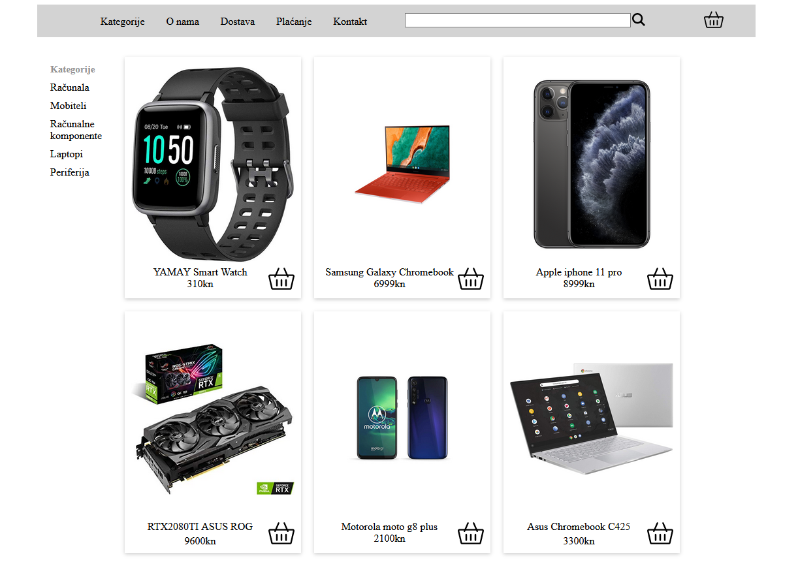

# E-com

Basic e-commerce aplication. Fetches data from a mongo database using rest api.

**Goal:** Learning and practicing, typescript, rest, webpack and monogdb

The app looks like this:

In the project directory, you can run:
`npm start`

Runs the app in the development mode.
Open http://localhost:3000 to view it in the browser.
