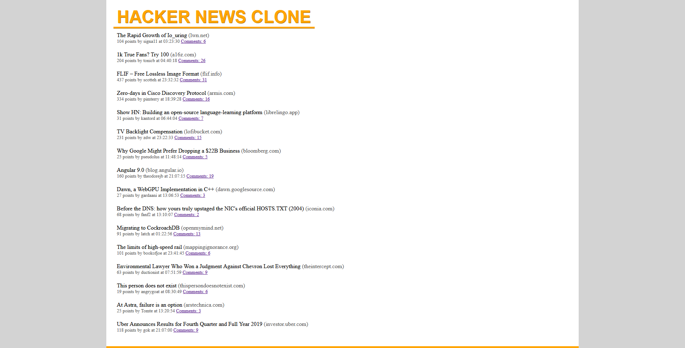

# Weather forecast
**Goal:** Practicing react and the usage of an api

The app looks like this:

In the project directory, you can run:
`npm start`

Runs the app in the development mode.
Open http://localhost:3000 to view it in the browser.
